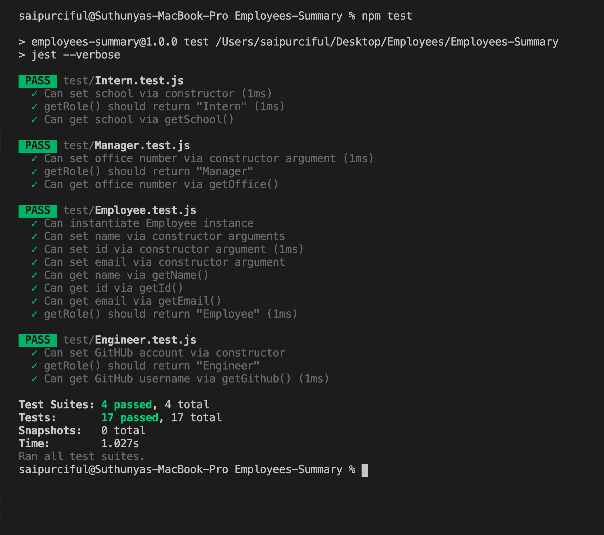
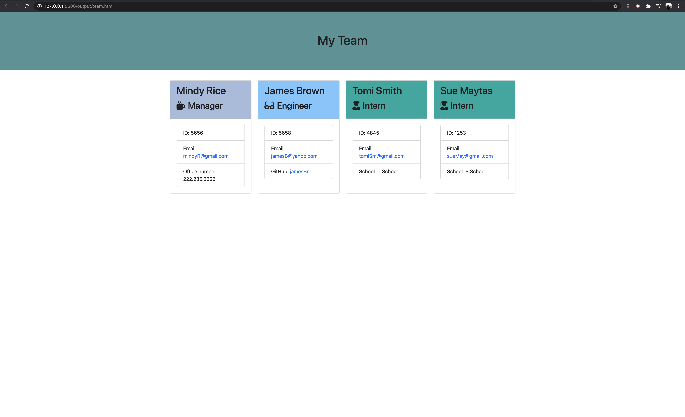

# Employees-Summary

README.md

# Employees Summary 

## Table of Content

* [Installation Instructions](#Installation-Instruction)
* [Description](#Description )
* [Usage Information](#Usage-Information)
* [License](#License)
* [Contributing Guildline](#Contributing-Guildline)
* [Tests Instructions](#Tests-Instructions)
* [Questions](#Questions)

## Installation Instructions
npm init | npm install inquire | npm install jest -cli | npm install inquire

## Description
It's a Node CLI that takes in information about employees and generates an HTML webpage that displays summaries for each employee in the team. 

## Usage Information

Node.js, Command line application

## License

    
## Contributing Guildeline

I encourage public contributions.

## Tests Instructions

The Command Line Application will prompt a user a multiple choices for team member's role. Once the user choose the role, the Command Line Application will prompt the questions about the member's information. The user can choose as much as member they want to completed the team. Once the user answered all the questions, the Command Line application will generate an HTML webpage that displays summaries of each person in the team. 

## How to: npm run test
* In Command Line Application: npm i jest -cli
* In package.jason: "scripts": {"test": "jest --verbose"},
* Back to Command Line Application: run test 

* This assignment has passed all test  

## Demonstration Video

 

* Link to Demonstration on YouTube: https://www.youtube.com/watch?v=WzKGnGd7W9o&feature=youtu.be

## Deployed webpage

## Questions

  * Github user name : saipurciful  
  * Github link : https://github.com/Saipurciful
  * How to reach me with additional questions : https://github.com/Saipurciful

## Link to the project site. 
* N/A
